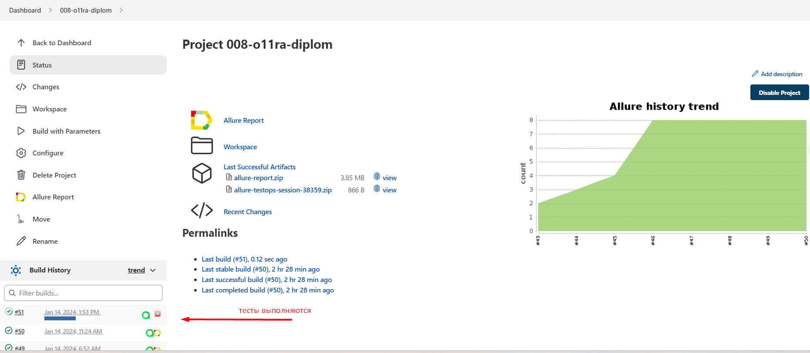
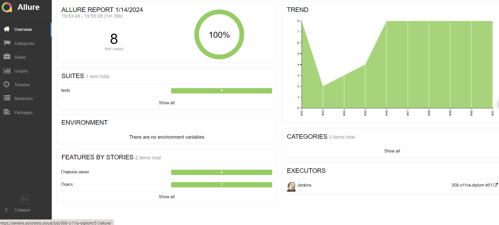

## Автоматизация тестирования  веб-сайта объявлений о продаже, покупке, аренде недвижимости в Казахстане [Krisha.kz](https://krisha.kz/)


----

### Инструменты и технологии, используемые в проекте
<p>
<a href="https://www.python.org/"></a>
<a href="https://docs.pytest.org/en/"></a>
<a href="https://www.jetbrains.com/pycharm/"></a>
<a href="https://www.selenium.dev/"></a>
<a href="https://github.com/yashaka/selene/"></a>
<a href="https://python-poetry.org/"></a>
<a href="https://docs.pydantic.dev/latest/"></a>
<a href="https://www.jenkins.io/"></a>
<a href="https://allurereport.org/"></a>
<a href="https://qameta.io/"></a>
<a href="https://aerokube.com/selenoid/"></a>
<a href="https://www.atlassian.com/software/jira"></a>
</p>

### Особенности проекта

* Оповещения о тестовых прогонах в Telegram
* Отчеты с видео, скриншотом, логами, исходной моделью разметки страницы
* Сборка проекта в Jenkins
* Отчеты Allure Report
* Интеграция с Allure TestOps
* Автоматизация отчетности о тестовых прогонах и тест-кейсах в Jira
* Запуск web/UI автотестов в Selenoid


### Покрываемый функционал
- Выполнение поиска без авторизации по умолчанию
- Выполнение поиска покупки/аренды квартиры
- Главное меню:
  - Открывается страница "Продажа", отображается верный заголовок
  - Открывается страница "Аренда", отображается верный заголовок
  - Открывается страница "Оценка", отображается верный заголовок
  - Открывается страница "Новостройки", отображается верный заголовок, выбран параметр поиска по ЖК в продаже
  - Открывается страница "Новости", отображается верный заголовок
  - Открывается страница "Крыша Гид", отображается верный заголовок

----    

### Запуск тестов
#### По умолчанию производится запуск всех тестов *локально*
Для управления параметрами локального запуска необходимо создать файл .env.local
В проекте есть пример файла `.env.local.example`


### Для локального запуска
1. Склонируйте репозиторий
2. Откройте проект в PyCharm
3. Введите в терминале команду

``` 
python -m venv .venv
source .venv/bin/activate
pip install poetry
pytest --context=local
```
для удаленного запуска тестов через Selenoid необходимо создать файл `.env.test` или `.env.prod` и передать параметр:

```
--context={env_context} 
```
где `{env_context}`  - выбранное окружение, на котором запускаются тесты

В проекте есть примеры файлов `.env.test.example`, `.env.prod.example`


### Для запуска тестов в [Jenkins](https://jenkins.autotests.cloud/job/008-o11ra-diplom/)

1. Открыть проект по [ссылке](https://jenkins.autotests.cloud/job/008-o11ra-diplom/)
2. Нажать `Build with Parameters`
3. Установить параметры или оставить по-умолчнанию 
4. В поле "COMMENT" ввести комментарий
5. Нажать `Build`


6. Дождаться прохождения тестов



----
### Allure-отчет

По итогам тестов будет сфоримирован `ALLURE REPORT`




#### Список тест-кейсов

#### Пример отчета о прохождении теста


----
### Allure TestOps

#### Общий список всех кейсов, имеющихся в системе


#### Пример dashboard с общими результатами тестирования


----
### Интеграция с Jira


----
### Оповещение о результатах прохождения тестов в Telegram


----
### Пример видео прохождения автотеста
Тест-кейс "Регистрация без ввода пароля"

